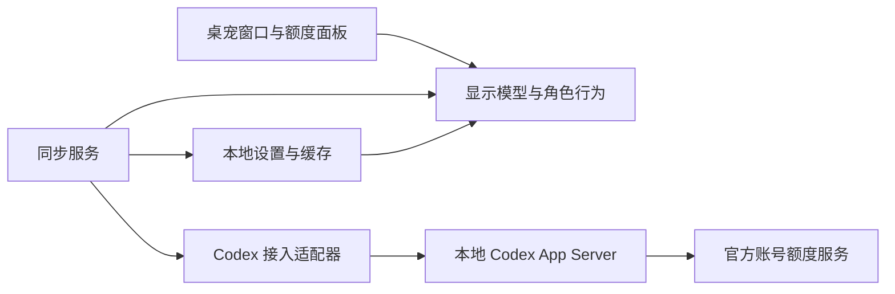

# CutePet 项目开发文档

版本：0.1（开发基线草案）  
日期：2026-10-01  
仓库：[BOWEN-YAO1/cutepet](https://github.com/BOWEN-YAO1/cutepet)  
状态：开发原型 0.8.1 已实现独立额度读取、桌宠窗口、角色包与自定义角色管理、角色动画、独立大小、四方向停靠、悬停详情、位置锁定与默认关闭的开机启动开关。核心接入、14 项协议与 154 项界面和功能状态检查通过。启动开关使用内存存储进行自动测试，实际用户登录启动、鼠标交互和动画体验待人工验收。见 [接入记录](codex-integration-validation.md) 和 [窗口说明](desktop-shell.md)。

## 1. 项目目标

CutePet 是一个面向 Windows 的桌面宠物，用角色动画和小型面板展示 Codex 账号的剩余额度及重置时间。用户日常双击程序即可启动，使用 Codex 后，桌宠自动同步官方额度。

项目首先服务于个人使用，并以公开 GitHub 项目持续开发。默认在本机运行，第一版不建设业务服务器，不要求用户把账号凭据交给项目维护者。

“自动扣除”是同步官方扣除后的结果。应用不修改账号额度，也不按消息数量自行推算扣减。订阅额度、购买的 credits 和 API 账单是不同的数据，不混成一个人民币余额。订阅消耗受模型、任务和上下文等影响，不能依据提示词长度准确推算。[官方额度说明](https://learn.chatgpt.com/docs/pricing#what-are-the-usage-limits-for-my-plan)

## 2. 已知条件与验证边界

| 项目 | 当前结论 | 后续工作 |
|---|---|---|
| 仓库 | 公开仓库，已有 README、开发文档及原型开发分支 | 通过 PR 审阅并迭代模块 |
| 许可证 | 现有 LICENSE 为 GNU GPL 第 3 版文本 | 保留现有文件，第三方素材另行记录许可 |
| 额度数据 | 当前 Codex 应用可读取账号额度快照 | 不把应用内工具视为第三方桌宠可直接调用的接口 |
| 独立接入 | 原生 CLI 0.159.2 核心读取链路已实测 | 补齐首次登录、重置、真实账号切换、跨设备和长期运行测试 |
| Windows 外观 | 计划采用透明置顶窗口和透明动画素材 | 实测拖动、缩放、显示比例和多显示器 |
| 发布 | 计划通过 GitHub Releases 分发 Windows 便携包 | 第一版依赖已安装的兼容 Codex CLI |

先完成独立接入验证，再将其写成产品承诺。只读设计阶段无需 OpenAI API key；实际账号接入按验证后的认证流程处理。

## 3. 第一版范围

### 3.1 v0.1 MVP

- 单个 Codex 账号连接，读取官方额度数据。
- 透明无边框桌宠，可置顶、拖动、缩放、隐藏。
- 一个原创或具有明确授权的角色，支持待机、眨眼、点击反应和低额度状态。
- 额度面板展示服务返回的窗口、剩余百分比、重置倒计时和最后同步时间。
- 自动刷新及手动刷新，处理未登录、断网、限流、辅助进程退出和协议不兼容。
- 托盘显示/隐藏、刷新、设置和退出；单实例运行。
- 保存位置、大小和显示偏好；发布 Windows x64 便携压缩包。

### 3.2 延后实现

安装包、更新提示、更多角色和动作、历史图表、Windows ARM64、鼠标穿透模式。0.7.0 已提前实现默认关闭的开机启动开关、位置锁定和基础角色动画。

工作状态检测作为单独探索项：只有获得可靠任务状态来源，才展示“正在执行 Codex 任务”。额度变化不能充当任务开始或结束信号。多账号、macOS/Linux、Live2D、模型聊天、语音陪伴、付费服务和自动更新不进入 v0.1。

## 4. 用户启动与退出流程

### 首次使用

1. 从 Releases 下载项目发布的 Windows 包，而不是 GitHub 自动生成的源码 ZIP。
2. 解压到固定且可写的安装位置，双击 `CutePet.exe`（计划名称）。
3. 程序检测兼容的 Codex CLI。未找到时显示安装指引，也允许用户选择已安装的可执行文件。
4. 检查账号状态。可复用的登录状态以实际验证为准；否则引导官方登录，不要求用户粘贴密码或访问令牌。
5. 成功取得额度后显示角色和面板；设置简单偏好。

### 日常使用

双击快捷方式 → 读取设置 → 启动后台连接 → 显示上次位置 → 同步额度。显示缓存时明确注明“上次数据”；未取得新数据前不声称已同步。重复启动只激活现有实例。关闭设置窗口不退出桌宠；退出操作放在托盘和右键菜单。

退出时取消同步、保存设置、停止本应用创建的辅助进程。不得终止用户自己启动的 Codex 进程。开机启动默认关闭，由用户主动启用；退出程序保留已启用的启动项，可从菜单关闭。

## 5. 技术方案与分层

桌面端计划使用 C# + WPF，采用 MVVM 分离界面与逻辑；.NET 版本在搭建工程时选择受支持的 LTS 并锁定。WPF 提供透明窗口和置顶属性，仍需在目标设备实测。[透明窗口](https://learn.microsoft.com/en-us/dotnet/api/system.windows.window.allowstransparency)、[置顶窗口](https://learn.microsoft.com/en-us/dotnet/api/system.windows.window.topmost)

首选通过本地 `codex app-server` 的 stdio 与后台连接。它是 CLI 提供的接口，不假设桌面应用提供可供本项目调用的网络服务。初始化和消息格式遵循所选 CLI 版本；通过适配层隔离未来协议变化。[官方 App Server 文档](https://learn.chatgpt.com/docs/app-server)



| 模块 | 职责 | 边界 |
|---|---|---|
| Desktop | 窗口、面板、托盘、设置、单实例 | 不解析官方协议 |
| Core | 额度模型、连接状态、同步策略、角色规则 | 不依赖 WPF |
| Codex | 进程管理、初始化、账号检查、额度请求、通知解析 | 不直接更新界面 |
| Animation | 素材加载、动画播放、状态切换 | 不调用模型 |
| Storage | 设置、脱敏额度缓存、错误日志 | 不存明文访问令牌 |
| Release | 构建检查、打包、版本说明 | 不包含真实账号数据 |

动画可以先作为 Desktop 内部目录实现，避免为每个小模块创建独立工程。接入层定义 `IQuotaProvider`，测试和演示通过明确标记的模拟实现运行。

## 6. Codex 接入验证

官方文档列出 `account/read`、`account/rateLimits/read` 和 `account/rateLimits/updated`。额度响应包括使用比例、窗口长度和重置时间；多额度桶存在时优先保留多桶视图。managed ChatGPT 模式由 Codex 管理登录凭据。[账号与额度接口](https://learn.chatgpt.com/docs/app-server#auth-endpoints)

PoC 按以下顺序完成：

1. 记录本机 Codex CLI 版本、安装来源和实际支持的 schema。
2. 启动应用拥有的 App Server 子进程，完成初始化握手。
3. 检查当前认证和账号范围；复用已验证的登录，或走官方登录流程。
4. 仅请求额度，记录脱敏后的结构，与相同账号/工作区的官方界面核对。
5. 在已有 Codex 客户端正常完成一次实际任务，观察独立读取何时反映变化；不为制造消耗自动发起任务。
6. 验证通知是否覆盖其他客户端的消耗；定时读取仍作为兜底。
7. 测试断网、认证过期、账号切换、空字段和子进程退出。

产出 `docs/codex-integration-validation.md`：兼容版本、步骤、脱敏样例、刷新延迟观察、认证方式和未解决问题。该文件在验证完成后再创建，不能提前填成成功报告。

若接入失败，先保留带“演示数据”标识的界面用于开发；真实额度功能不验收通过，也不改用抓取密码、截屏识别或逐条消息估算作为正式数据源。

## 7. 数据模型与同步规则

### 7.1 统一模型

| 字段 | 含义 |
|---|---|
| ConnectionState | MissingDependency、Connecting、NeedsLogin、Connected、Offline、Incompatible、Error |
| AccountScope | 内部账号/工作区范围，隔离缓存；不公开原始标识 |
| LimitId / DisplayName | 额度桶标识与显示名称 |
| Windows | 服务实际返回的一个或多个额度窗口 |
| UsedPercent / RemainingPercent | 官方使用比例及换算的剩余比例，可为空 |
| WindowDurationMinutes | 额度窗口长度，可为空 |
| ResetsAtUtc | 官方重置时间，可为空 |
| LastSuccessfulSyncUtc | 最后一次成功读取的时间 |
| IsStale / Source | 是否为旧数据；来源为官方或明确标识的演示数据 |

剩余比例按 `clamp(100 - usedPercent, 0, 100)` 换算。缺失数据显示“暂无数据”，不填 0%。界面标签按返回窗口生成，不写死所有账号都有“5 小时”和“每周”额度。credits 展示为可选后续能力，不与百分比合并。

### 7.2 刷新策略（初始设计值，PoC 后调整）

- 启动时读取一次；正常默认每 60 秒读取，使用额度通知加快刷新。
- 手动刷新与定时读取共用一个请求队列，同一时刻最多一个额度请求。
- 设置合理超时；连续失败按 60、120、240 秒退避，最长 5 分钟，并增加少量抖动。服务返回重试提示时优先遵循。
- 休眠期间不累计请求；恢复后重新读取。通知只更新明确包含的数据，不覆盖未返回的字段。
- 倒计时归零后重新读取；在官方确认前显示“等待额度更新”，不自行设为 100%。
- 账号/工作区切换后停止旧请求、清除旧显示并隔离缓存，拒绝旧请求迟到的响应。
- 失败时保留最后成功数据并显示旧数据状态；退避后成功则恢复正常刷新。

本地时间只用于展示倒计时，内部使用 UTC；系统时间变化后重新计算。不得承诺 token 级实时扣减或展示精确的“本条消息花费”。

## 8. 角色与面板设计

角色使用透明 PNG 序列帧或精灵图。第一版先确保轮廓清晰、动作连续，再丰富数量。每个素材包包含名称、帧尺寸、帧率、锚点、动作清单、作者和许可。解码后的素材复用，隐藏时暂停动画。

| 触发条件（初始规则） | 角色表现 |
|---|---|
| 正常额度 | 待机、随机眨眼 |
| 用户点击 | 短暂回应，随后回到当前额度状态 |
| 任一有效窗口剩余低于 20% | 疲惫表情，可关闭提醒 |
| 任一有效窗口剩余低于 5% | 低额度提示，同一窗口与重置周期内不重复打扰 |
| 官方确认重置且额度恢复 | 一次开心动作 |
| 数据未知或过期 | 中性表情，连接状态由面板说明 |

额度增加也可能来自账号切换、额度调整或数据修正，只有确认窗口重置才触发恢复庆祝。当前面板平时保持小巧，通过悬停展开详情，也可固定显示或隐藏；第一版不使用语音提醒。0.4.0 默认额度条在角色左侧偏下，拖角色移动整体，拖额度条吸附到上 / 下 / 左 / 右；右键与托盘也可选择，保存方向。自由偏移和拆分成独立窗口留待后续反馈。

## 9. 设置、隐私与本地文件

建议使用 `%LOCALAPPDATA%\CutePet\` 保存 `settings.json`、脱敏额度缓存和轮转日志，不将运行数据放进源码目录或发布包。设置包含窗口位置、缩放、置顶、提醒开关、刷新间隔、角色选择和 CLI 路径。

凭据由经过验证的认证机制管理。CutePet 不复制用户 auth 文件，不把令牌写入设置或日志；连接器诊断只保存允许的非敏感字段。共享登录环境下不通过“退出桌宠”注销其他 Codex 客户端。提供“清除本地缓存”，与账号注销区分。

默认不采集遥测。公开的问题反馈只附程序版本、兼容 CLI 版本和脱敏错误信息。新增素材须明确可分发，不将参考视频截图中的角色直接打包。保留仓库现有 GPL v3 许可证文本，第三方依赖和素材通过 `THIRD_PARTY_NOTICES.md` 记录实际许可。

## 10. 计划目录结构

以下是目标结构，并非当前已存在的文件：

```text
cutepet/
├─ README.md
├─ LICENSE
├─ docs/
│  ├─ development.md
│  └─ codex-integration-validation.md   # PoC 完成后新增
├─ src/
│  ├─ CutePet.Desktop/
│  ├─ CutePet.Core/
│  └─ CutePet.Codex/
├─ tests/
│  ├─ CutePet.Core.Tests/
│  └─ CutePet.Codex.Tests/
├─ assets/pets/
├─ scripts/
├─ .github/workflows/
└─ THIRD_PARTY_NOTICES.md               # 引入素材/依赖时新增
```

仅为真实业务规则、错误恢复和协议适配编写必要测试，不为静态素材或简单窗口属性堆叠测试。模拟数据必须是虚构数据。

## 11. 里程碑与验收

| 阶段 | 主要产出 | 完成标准 |
|---|---|---|
| M0：文档基线 | README、开发文档、边界和待验证清单 | 文档可作为开发任务依据 |
| M1：额度 PoC | 独立接入验证记录、读取原型 | 相同范围数据可核对；正常使用后可同步；认证和失败路径明确 |
| M2：桌宠骨架 | 透明窗口、占位角色、面板、托盘 | 单实例，拖动/缩放/隐藏/退出正确，设置可恢复 |
| M3：真实数据与动画 | 接入真实额度、基础动画、低额度规则 | 额度不伪造，离线有标记，重置和切换不会混用数据 |
| M4：v0.1 发布 | 便携包、使用说明、兼容版本表、更新记录 | 目标 Windows 环境从下载到启动完整通过，无敏感文件 |
| M5：体验改进 | 启动项、安装包、角色切换、更新提示 | 根据实际反馈逐项验收 |

M1 是真实额度功能的前置门槛。M2 可先用明确标记的模拟数据推进。每个阶段按结果验收，当前不承诺完成日期。

### v0.1 必测场景

- 全新配置首次启动；CLI 不存在、不兼容或路径含空格。
- 已登录与未登录；相同账号不同工作区；凭据失效。
- 一个或多个额度桶、窗口缺失、比例为 0/100、空字段、未知字段。
- 官方窗口重置；缓存过期；账号切换时旧响应返回。
- 断网、超时、限流、辅助进程崩溃、睡眠/恢复。
- 重复启动、托盘恢复、退出后无本应用遗留进程。
- 目标 Windows 11 x64，100%/150%/200% 显示比例；移除第二显示器后角色仍可见。
- 发布包不含凭据、真实账号信息或开发者缓存；未安装 .NET SDK 的环境可运行桌宠主程序。

性能目标：闲置时无持续高 CPU 活动，无后台模型推理；长时间运行内存不持续增长。M2 测量空闲 CPU、内存、启动时间和隐藏后占用，形成可复测基线后再定数值预算。

## 12. 构建、发布与更新

开发者需要 .NET SDK 和兼容 Codex CLI；普通用户下载发布包。v0.1 主程序使用自包含部署携带 .NET 运行环境，发布为 ZIP 文件夹；不强求所有素材和辅助程序挤进单个 EXE。[微软自包含与单文件部署说明](https://learn.microsoft.com/en-us/dotnet/core/deploying/single-file/overview)

v0.1 依赖用户已安装的兼容 CLI，并在 README 和程序内说明。随包附带官方读取组件是后续方案，须确认来源、许可、架构、版本和完整性后再实施。界面应给出清楚指引，不静默安装依赖。

计划设置两类 GitHub Actions：提交/PR 执行构建和必要测试；版本标签触发 Windows 打包并生成 Release 草稿。真实账号验证在维护者本机完成，不向 CI 填入个人 Codex 凭据。发布前人工检查文件与说明，再发布资产。[GitHub Releases 文档](https://docs.github.com/en/repositories/releasing-projects-on-github/about-releases)

拟定资产名称 `CutePet-v0.1.0-win-x64.zip`，附校验值、支持环境、兼容 CLI 版本、首次连接步骤和已知问题。无代码签名的发布包可能触发系统信誉提示，说明中如实标注签名状态，不指导关闭系统防护。

第一版手动下载新版并替换程序目录；设置留在用户数据目录。升级先退出旧实例，保留旧包便于回退。自动更新留到后续版本，届时设计完整性校验、失败回退和配置迁移。

## 13. 待定事项与默认方向

| 事项 | 默认方向 | 确定时点 |
|---|---|---|
| 首发平台 | Windows 11 x64；其他环境另行验证 | M2 |
| .NET 版本 | 受支持的 LTS，锁定 SDK | 搭建工程 |
| CLI 认证和版本 | 官方机制，避免复制凭据 | M1 |
| 通知与读取刷新延迟 | 60 秒读取为初始值，通知加速 | M1 |
| 角色形象 | 原创简单角色，先做基础动作 | M2–M3 |
| 自动启动 | 0.7.0 已实现，默认关闭，由用户主动启用，实际登录启动待验收 | M5 |
| 附带读取组件 | v0.1 使用外部兼容 CLI | 发布方案评估 |
| 商业或托管版本 | 超出当前项目范围，需重新评估认证路径 | 扩展立项时 |

M1 核心读取链路已通过。M2 已有透明窗口、占位小猫、额度面板、托盘与设置；已接入真实额度，并加入基础眨眼和点击回应。当前用 .NET 8 实现，开发便携包依赖 .NET 8 Desktop Runtime，不等同于完整发布版。下一步按 [窗口说明](desktop-shell.md) 完成人工桌面验收，再制作正式角色及丰富动画；原有账号场景继续补测。


## 0.8.0 角色包进展（2026-10-02）

小猫与洛天依已整理为各自的 character.json + PNG + 来源 / 许可说明，统一加载和动作播放器。新增本地角色库与角色管理窗口，支持 PNG 静态导入、ZIP 动画包导入、预览、使用、导出、移除归档及重启恢复。旧角色枚举设置迁移为 CharacterPackId，额度读取、独立缩放、布局、锁定和开机启动开关保持。

协议验证仍为 14 项；WPF 与功能验证扩展到 154 项，新增端到端包流转、错误包边界和实际管理窗口事件。人工文件选择和桌面观感待试用。当前支持 idle / blink / greeting / low 四种触发，不新增聊天功能、桌面行走、骨骼动画、在线角色商店或自动下载。格式和制作方式见 [角色包说明](character-packs.md)。

## 0.8.1 结构整理（2026-10-02）

桌宠代码按 Views、Quota、Characters、Settings、Layout、Platform、Verification 分目录，内置角色包移至 Characters/Packs。角色库、角色包校验和偏好保存分别独立成文件。主窗口的详情状态、鼠标拖动状态、动画计时和菜单组成分配给独立模块，保留现有设置格式与行为；主窗口代码从 661 行缩减为 361 行。

原有 154 项功能和 14 项协议测试通过，36 张离屏状态截图与 0.8 完全一致。examples 继续作为产品源码之外的可用示例，并加入入口说明。职责、修改位置和验证边界见 [项目结构说明](project-structure.md)。

## 0.11.0 乘云飘动

2026-10-02：新增天依独立云层（cloud-v1.png）、施法召唤和短距离横向飘动、自动开关与交互暂停。角色素材保留原有脸、服装和动作；小猫保留原行为。云由内置 image_gen.imagegen 生成，1774×887 原始透明 PNG，完整提示词位于角色包 CLOUD-PROMPTS.md 及 SOURCE.md。运动与验证边界详见 docs/cloud-drift.md；属于非官方同人设计，原角色权利说明继续适用。
